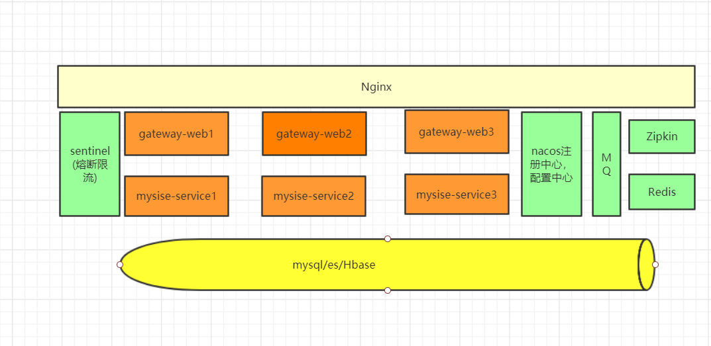

**基于Spring boot 2.x.x + dubbo 构建的微服务脚手架**

**项目结构**

    mysise-common ------------公用包部分
    mysise-gateway -----------web/api入口
    mysise-service -----------dubbo业务服务层      
    
**相关组件**
    
    网关：（PS：缺少）
    
    缓存：redis

    流控，熔断  sentinel

    链路追踪：zipkin

    配置中心/注册中心: nacos
    
    数据库：mysql，orm：mybatis-plus
    
**系统大概架构**

